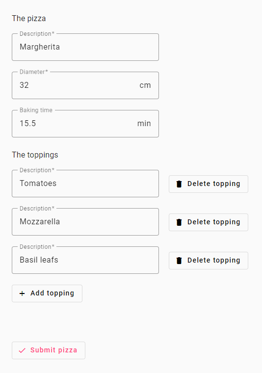
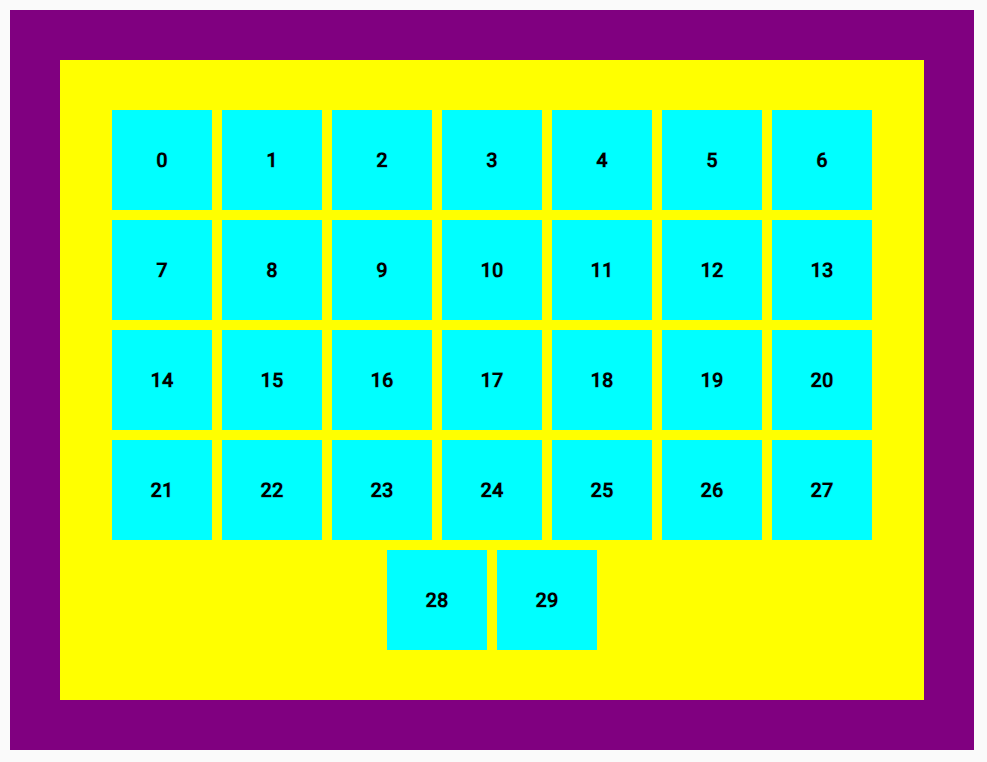

# Aufgabe 1 - Angular Single Page Application

## Aufgabenstellung

Erstelle eine Angular Applikation (von Scratch, siehe [ng new](https://angular.dev/cli/new)) und verändere / erweitere den Code wie folgt:

### Technologien und Struktur

- Verwende [Node.js 20.15.0 oder aktueller](https://nodejs.org/en/download)
- Verwende [Angular 17 oder aktueller](https://angular.dev/)
- Verwende [Angular Material 17 oder aktueller](https://material.angular.io/) mit Material Icons, Roboto Font und einem prebuilt Theme

### Funktion 1: Form zur Eingabe von Werten für die Erstellung einer Pizza

**Eingabewerte**

_Pizza_

| input       | type   | required | valid range                       |
| ----------- | ------ | -------- | --------------------------------- |
| description | text   | yes      | maximum length of 32 characters   |
| diameter    | number | yes      | 20 <= diameter <= 40, step of 1.0 |
| bakingTime  | number | no       | 0.0 <= bakingTime, step of 0.1    |

_Toppings - zero to many per pizza_

| input       | type | required | valid range                     |
| ----------- | ---- | -------- | ------------------------------- |
| description | text | yes      | maximum length of 32 characters |

Über einen Button soll es möglich sein, ein zusätzliches Topping hinzuzufügen. Hinzugefügte Toppings sollen wieder entfernt werden können.

Verwende [Reactive Forms](https://angular.dev/guide/forms/reactive-forms). Validiere die eingegeben Werte gemäss dem gültigen Wertebereich.

**Übermitteln einer Pizza**

Sobald alle Eingaben der Werte von Pizza inklusive Toppings gültig sind, soll es möglich sein, die Pizza als POST Request zu übermitteln. Dazu soll ein weiterer Button hinzugefügt werden.

Verwende den [HttpClient](https://angular.dev/guide/http). Der POST Request kann an eine ungültige URL geschickt werden (z.B. `http://localhost/api/pizzas`) und soll die eingegebenen Werte im JSON Format im Request Body beinhalten.

**Gestaltung**

Beispiel:

Deine Resultate können bezüglich Gestaltung vom Beispiel abweichen. Achte darauf, dass alle oben beschriebenen Funktionen umgesetzt sind und die Darstellung für dich intuitiv ist.

### Funktion 2: Farbige Quadrate mit Flexbox

Stelle farbige Quadrate mit [Flexbox](https://www.w3schools.com/css/css3_flexbox.asp) gemäss nachfolgendem Beispiel dar:

Kriterien:

- Darstellung von 30 farbigen Quadraten, in jedem Quadrat wird der Index angezeigt
- Keine Überlappung der Quadrate, Abstände zwischen den Quadraten (horizontal und vertikal)
- Quadrate sind umgeben von innerem und äusserem Element, jeweils in unterschiedlichen Farben
- Darstellung der Anzahl Quadrate pro Zeile wächst / schrumpft dynamisch mit Seitenbreite

Wähle sinnvolle Werte für Dimensionen und Abstände sowie HTML Elemente.

### Abgrenzung Aufgabenstellung

Um Umfang und Komplexität zu reduzieren sind folgende Aspekte NICHT Teil der Aufgabenstellung:

- Testing
- Unterteilung in Komponenten -> Implementation mit `app.component` ist ausreichend
- Routing
- Accessibility
- Internationalization

## Bewertungskriterien

Wir achten bei der Bewertung deiner Resultate unter anderem auf:

- Anwendung von Entwurfsmustern / Design Patterns und Best Practices
  - z.B. [Clean Code](https://gist.github.com/wojteklu/73c6914cc446146b8b533c0988cf8d29) oder [Angular Coding Style Guide](https://angular.dev/style-guide)
- Einsatz von Packages
- Lauffähigkeit
